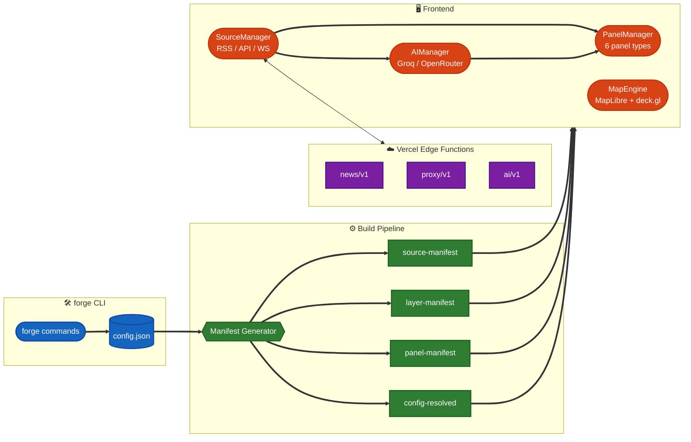
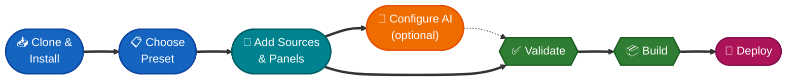
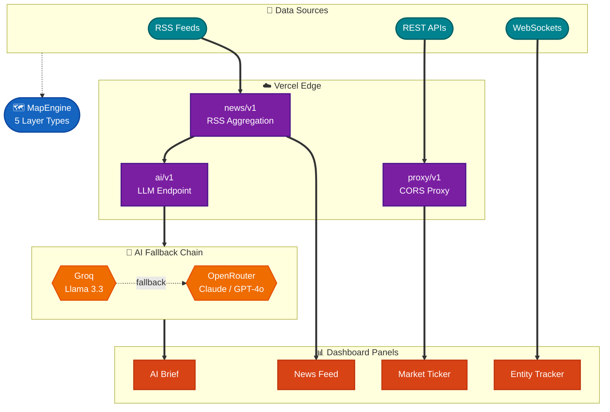

<div align="center">

# monitor-forge

**Build real-time intelligence dashboards with AI agents.**

The first agent-native dashboard framework — designed for [Claude Code](https://docs.anthropic.com/en/docs/claude-code), [Gemini CLI](https://github.com/google-gemini/gemini-cli), and other AI coding agents to build customized dashboards through conversation.

[](https://github.com/alohays/monitor-forge/actions/workflows/ci.yml)
[](https://opensource.org/licenses/MIT)
[](https://nodejs.org/)
[](https://www.typescriptlang.org/)
[](https://github.com/alohays/monitor-forge/releases)

[Quick Start](#quick-start) · [Why monitor-forge?](#why-monitor-forge) · [Presets](#available-presets) · [CLI Reference](#cli-commands) · [Contributing](./CONTRIBUTING.md)

</div>

---

> "I want a dashboard tracking Korean robotics news with AI analysis."
>
> That's it. Tell an AI agent, and monitor-forge builds it.

## Why monitor-forge?

[WorldMonitor](https://github.com/koala73/worldmonitor) proved the demand — 25K+ stars and 4,100+ forks. But every fork requires manual customization: editing source code, rebuilding, and redeploying.

**monitor-forge** inverts this: describe what you want, and an AI agent builds it using a structured CLI.

| | WorldMonitor | Manual Fork | **monitor-forge** |
|---|---|---|---|
| Setup time | N/A (single purpose) | Hours to days | **Minutes** |
| Customization | Edit source code | Edit source code | **CLI commands** |
| AI agent support | None | None | **Native** (AGENTS.md, Skills) |
| Domain presets | 1 | 1 per fork | **7 included** |
| AI analysis | None | DIY | **Built-in** (Groq/OpenRouter) |
| Adding sources | Edit code | Edit code | **`forge source add`** |
| Deploy | Manual | Manual | **One-click** (Vercel) |

## Architecture



## Quick Start

```bash
git clone https://github.com/YOUR_USERNAME/monitor-forge.git my-monitor
cd my-monitor
npm install    # auto-generates manifests
npm run dev    # dashboard at http://localhost:5173
```

Ships with a **tech-minimal** preset (Hacker News, TechCrunch, Ars Technica) out of the box. No API keys required.

### Workflow



### Using with AI Agents

Open the project in Claude Code (or any AGENTS.md-compatible agent) and say:

> "I want to create a geopolitics monitor focused on Southeast Asia"

The agent reads CLAUDE.md/AGENTS.md, uses the forge CLI, and builds your dashboard. See [CLAUDE.md](./CLAUDE.md) for Claude Code integration or [AGENTS.md](./AGENTS.md) for other agents.

> [!NOTE]
> Every `forge` command supports `--format json --non-interactive` for AI agent consumption.

### Manual Customization

```bash
# Browse and apply a preset
npm run forge -- preset list
npm run forge -- preset apply finance-full

# Add custom sources
npm run forge -- source add rss \
  --name "reuters" \
  --url "https://feeds.reuters.com/reuters/topNews" \
  --category world-news

# Enable AI analysis (optional — free tier available)
npm run forge -- ai configure \
  --provider groq \
  --model "llama-3.3-70b-versatile" \
  --api-key-env GROQ_API_KEY

# Validate and deploy
npm run forge -- validate
npm run deploy
```

## Data Flow



## Available Presets

> [!TIP]
> Start with a `*-minimal` preset to get running fast, then graduate to `*-full` when you need more sources and panels. Use `blank` for a completely custom build.

| Preset | Domain | Sources | Panels | Description |
|--------|--------|---------|--------|-------------|
| `blank` | general | 0 | 0 | Empty canvas — start from scratch |
| `tech-minimal` | technology | 3 | 2 | HN, TechCrunch, Ars Technica |
| `tech-full` | technology | 8 | 4 | + Verge, Wired, MIT Tech Review, arXiv, GitHub |
| `finance-minimal` | finance | 3 | 2 | Reuters, CNBC, CoinDesk |
| `finance-full` | finance | 6 | 4 | + FT, Bloomberg, Fed RSS |
| `geopolitics-minimal` | geopolitics | 3 | 2 | BBC, Reuters, Al Jazeera |
| `geopolitics-full` | geopolitics | 8 | 5 | + Guardian, AP, Foreign Affairs, GDELT |

## Key Features

- **CLI-first**: All customization via `forge` commands with `--format json` for agent consumption
- **Single config**: One `monitor-forge.config.json` defines your entire dashboard
- **7 presets**: Pre-built configurations for tech, finance, and geopolitics
- **Real-time map**: MapLibre GL + deck.gl with 5 layer types (points, lines, polygons, heatmap, hexagon)
- **6 panel types**: News feed, AI brief, market ticker, entity tracker, instability index, service status
- **3 source types**: RSS, REST API, WebSocket
- **AI analysis**: Summarization, entity extraction, sentiment via Groq/OpenRouter
- **One-click deploy**: Vercel Edge Functions with security headers
- **5 Claude Code Skills**: Pre-built agent workflows for common operations

## CLI Commands

| Command | Description |
|---------|-------------|
| `forge init` | Initialize a new dashboard |
| `forge preset list/apply` | Browse and apply presets |
| `forge source add/remove/list` | Manage RSS, API, WebSocket sources |
| `forge layer add/remove/list` | Manage map layers (points, lines, polygons, heatmap, hexagon) |
| `forge panel add/remove/list` | Manage UI panels |
| `forge ai configure/status` | Set up AI analysis pipeline |
| `forge validate` | Validate configuration |
| `forge env check/generate` | Manage environment variables |
| `forge build` | Build for production |
| `forge dev` | Start development server |
| `forge deploy` | Deploy to Vercel |

## Tech Stack

- **Frontend**: Vite 6, TypeScript 5, MapLibre GL, deck.gl, D3
- **Backend**: Vercel Edge Functions
- **AI**: Groq (Llama 3.3), OpenRouter (Claude, GPT-4o, etc.)
- **CLI**: Commander, Zod, tsx
- **Security**: DOMPurify, CSP headers, proxy domain allowlist

## Project Structure

```
monitor-forge/
├── forge/              # CLI tool (Commander + Zod)
├── src/                # Frontend application
│   ├── core/           # Map, panels, sources, AI engines
│   └── styles/         # CSS
├── api/                # Vercel Edge Functions
├── presets/            # 7 preset templates
├── data/geo/           # GeoJSON data files
├── .claude/skills/     # 5 Claude Code Skills
├── CLAUDE.md           # Claude Code agent guide
├── AGENTS.md           # Cross-agent compatibility guide
└── monitor-forge.config.json
```

## Contributing

Contributions are welcome! See [CONTRIBUTING.md](./CONTRIBUTING.md) for guidelines.

## License

[MIT](./LICENSE) — Copyright (c) 2026 Yunsung Lee
