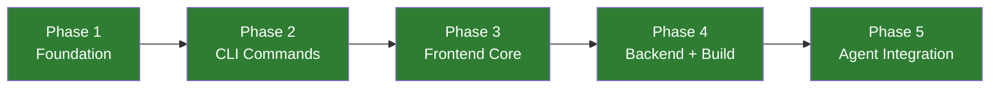

# monitor-forge: Project Status

## Overall Progress: COMPLETE

| Phase | Status | Description |
|-------|--------|-------------|
| Phase 1 | DONE | Foundation - Repo structure + Zod schema + Config loader |
| Phase 2 | DONE | CLI Commands - All 11 forge commands |
| Phase 3 | DONE | Frontend Core - Map, Panels, Sources, AI |
| Phase 4 | DONE | Backend APIs + App shell + Vite config |
| Phase 5 | DONE | Agent integration + Presets + Polish |

## Phase 1 Checklist
- [x] Directory structure created
- [x] package.json with all dependencies
- [x] tsconfig.json configurations
- [x] Zod config schema (forge/src/config/schema.ts)
- [x] Config loader/writer (forge/src/config/loader.ts)
- [x] Default config template (monitor-forge.config.json)
- [x] Output formatters (forge/src/output/)
- [x] .gitignore

## Phase 2 Checklist
- [x] forge init command
- [x] forge source add/remove/list
- [x] forge layer add/remove/list
- [x] forge panel add/remove/list
- [x] forge ai configure/status
- [x] forge validate
- [x] forge env check/generate
- [x] forge preset list/apply
- [x] forge build
- [x] forge dev
- [x] forge deploy

## Phase 3 Checklist
- [x] MapEngine (MapLibre GL + deck.gl)
- [x] LayerManager + 5 built-in layers (Points, Lines, Polygons, Heatmap, Hexagon)
- [x] PanelManager + PanelBase
- [x] 6 built-in panels (AIBrief, NewsFeed, MarketTicker, EntityTracker, InstabilityIndex, ServiceStatus)
- [x] SourceManager + 3 built-in sources (RSS, API, WebSocket)
- [x] AIManager + 2 providers (Groq, OpenRouter)
- [x] Registry pattern + manifest generators
- [x] App shell (App.ts, main.ts, index.html, base.css)

## Phase 4 Checklist
- [x] API: news/v1 (RSS aggregation)
- [x] API: proxy/v1 (CORS proxy)
- [x] API: ai/v1 (LLM analysis)
- [x] API: _shared middleware (cors, cache, error)
- [x] forge build pipeline (manifests + Vite)
- [x] forge dev (Vite dev server)
- [x] forge deploy (Vercel CLI)
- [x] vercel.json generator

## Phase 5 Checklist
- [x] CLAUDE.md (<300 lines)
- [x] AGENTS.md
- [x] Skill: initializing-monitor
- [x] Skill: adding-data-sources
- [x] Skill: adding-map-layers
- [x] Skill: configuring-ai-pipeline
- [x] Skill: deploying-to-vercel
- [x] Presets (7): tech-minimal, tech-full, finance-minimal, finance-full, geopolitics-minimal, geopolitics-full, blank
- [x] GeoJSON base data
- [x] README.md
- [x] LICENSE (MIT)
- [x] GitHub Actions CI
- [x] Git initialized
- [x] Build verification (all CLI + Vite build passing)
